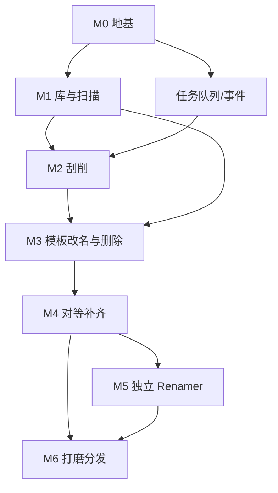

# kaigua 跨平台改造计划与功能清单

> 目标栈：Tauri 2 + Rust 核心 + React + Tailwind CSS  
> 对照基线：当前 Swift 6 / macOS 15 / SwiftUI 实现（约 20k LOC）  
> 状态：计划文档（实现前唯一功能对照基准）  
> 日期：2026-07-23

---

## 0. 技术栈（已定）

### 0.1 桌面壳

| 层 | 选型 |
|----|------|
| 应用壳 | Tauri 2 |
| 目标平台 | macOS / Windows / Linux |
| IPC | Tauri commands + events（进度须节流） |

### 0.2 核心（Rust）

| 层 | 选型 | 用途 |
|----|------|------|
| 语言 | Rust（edition 2021+） | domain 全量 |
| Workspace crates | `media-core` / `scraper-kit` / `renamer` + Tauri app | 对齐现四包边界 |
| 异步 | tokio | HTTP / 刮削；扫盘用 `spawn_blocking` |
| 数据库 | rusqlite + 自管 migration | 对齐现 SQLite schema |
| HTTP | reqwest | TMDB / TVDB / OMDb / Bangumi |
| 序列化 | serde / serde_json | API、配置、JSON 列 |
| 目录遍历 | walkdir（热路径再评 jwalk） | 扫描 / 增量 mtime |
| 图片 | image | 本地缩略图 |
| 正则 | regex | 文件名解析、重命名 |
| XML | quick-xml（或等价） | NFO 读写 |
| 错误 | thiserror / anyhow | 库内 / 应用边界 |
| 日志 | tracing + tracing-subscriber | 后端日志 |

### 0.3 前端（Web UI）

| 层 | 选型 | 说明 |
|----|------|------|
| UI | **React 19** + TypeScript | 已定 |
| 构建 | Vite（Tauri 默认） | |
| 样式 | **Tailwind CSS v4** | 已定；桌面工具布局，避免重型组件库绑死视觉 |
| 状态 | Zustand（或等价轻量 store） | 订阅 task / 库列表事件 |
| 列表 | `@tanstack/react-virtual` | 大库虚拟滚动 |
| i18n | i18next（或 typesafe-i18n） | M1：zh-Hans + en；M6：ja |
| 图标 | 轻量 SVG 集（如 lucide-react） | 不引入整包 Icon 框架亦可 |

### 0.4 配置与平台能力

| 层 | 选型 |
|----|------|
| 配置 | TOML 或 JSON（原子写） |
| API Key | 配置字段；可选系统密钥链 plugin |
| 选目录 | `@tauri-apps/plugin-dialog` |
| 通知 | `@tauri-apps/plugin-notification`（可选） |
| 废纸篓 | 自研抽象（macOS / Windows / Linux 降级） |
| 打开文件管理器 | Tauri opener / shell plugin |

### 0.5 工程

| 层 | 选型 |
|----|------|
| 包管理 | Cargo workspace + pnpm（前端） |
| 测试 | `cargo test`（黄金样例对齐 Swift）；前端按需 |
| CI | GitHub Actions 三平台 build + test |
| 分发 | Tauri bundler（dmg / msi / AppImage 等） |

### 0.6 明确不用

Electron、sqlx 强 async DB、Flutter、Swift 二进制嵌入、重型 UI kit（Ant/MUI 等默认不引入）。

---

## 1. 改造目标与原则

### 1.1 目标

1. 将 kaigua 从 **macOS-only SwiftUI** 改造为 **macOS / Windows / Linux** 桌面应用。
2. **功能对等优先**：以现有产品行为为规格，而不是重新发明产品。
3. **性能借机提升**：扫盘入库批量事务、HTTP 限流、缩略图管线、可选并行遍历；不指望网络刮削数量级变快。
4. **Swift 代码当规格书**：算法、状态机、匹配规则、NFO 约定以现实现 + 单测为准；不追求源码级复用。

### 1.2 硬原则（迁移过程中不得破坏）

| ID | 原则 | 来源 |
|----|------|------|
| P1 | Refresh（扫盘）与 Scrape（刮削）分离 | `architecture.md` |
| P2 | 批量刮削只处理 DB 中已有且 `unscraped` 的条目 | `ScrapeEngine` / `architecture.md` |
| P3 | 刮削成功后才允许自动改名 | `ScrapeWorkflowService` + `AutoRenameService` |
| P4 | 全局任务队列串行；刮削任务内部可并发 | `TaskQueue` + `ScrapeEngine.concurrency` |
| P5 | 所有破坏性文件操作须经统一 Filesystem 层，并产出 ChangeSet | `MediaFilesystemService` |
| P6 | 破坏性操作（删库/删文件/清理）必须显式确认 | `DeleteConfirmSheet` / cleanup 流 |
| P7 | 自动匹配规则保持严格：归一化标题完全相等 + 年份一致才自动接受 | `AutoMatchEvaluator`（`confidenceThreshold` 当前未生效，勿当作已实现） |
| P8 | NFO 是派生输出；SQLite 是权威数据源 | 现架构 |

### 1.3 非目标（明确不做或延后）

| 项 | 说明 |
|----|------|
| macOS Notch 任务浮层 | `App/TaskOverlay*`，跨平台无对等价值 |
| App Store 沙盒 + Security-Scoped Bookmark 完整语义 | 非沙盒桌面用路径即可；上架再做 adapter |
| 综艺 / 演唱会媒体类型 | 原设计二期，本改造不引入 |
| fanart.tv 独立源 | 规格提及，现实现未成独立 scraper |
| 元数据在线编辑 UI | 若现实现未完成，不作为对等必选项 |
| 把 Swift 二进制嵌入 Tauri | 全量重写核心 |

---

## 2. 总体改造路线

### 2.1 架构映射

```
现 Swift                         目标
─────────────────────────────    ────────────────────────────────
App/ (Notch, Window)          →  砍 / 可选 macOS 后期插件
AppUI Views/VMs               →  React + Tailwind CSS
AppUI Workflows/Services      →  Tauri commands + Rust task_queue
AppUI State (TaskQueue 等)     →  Rust 任务引擎 + 前端 store（事件驱动）
MediaCore                     →  crate: media-core
ScraperKit                    →  crate: scraper-kit
RenamerKit                    →  crate: renamer
GRDB/SQLite                   →  rusqlite + 自管 migration（schema 对齐）
UserDefaults / AppStorage     →  配置文件（JSON/TOML）+ 设置 UI
BookmarkManager               →  可选 platform_access（默认：明文路径）
ThumbnailCache (AppKit)       →  Rust 缩略图服务 + 前端消费本地路径
```

### 2.2 阶段总览

| 阶段 | 名称 | 目标 | 出口标准 |
|------|------|------|----------|
| **M0** | 地基 | 工程骨架、SQLite schema、配置、日志、任务队列空壳 | 能启动空壳 App，读写 DB，跑通 hello command |
| **M1** | 库与扫描 MVP | 加库、全量扫描、列表/详情、排除目录、NFO 导入 | 选一真实库扫完，条目正确出现 |
| **M2** | 刮削 MVP | TMDB + Bangumi；batch/selected/manual；写 NFO/海报；任务中心 | 电影+动漫各跑通一条完整刮削链 |
| **M3** | 整理 MVP | 模板改名、刮削后自动改名、删除（DB±文件）、设置页 | 刮削→改名→删除确认闭环 |
| **M4** | 对等补齐 | 增量扫描、TVDB/OMDb、重刮、清理、季整理、列表增强 | 与 Swift 版核心能力对等 |
| **M5** | 独立 Renamer | 规则引擎 UI、预览、执行、Undo、预设 | Renamer 窗口功能对等 |
| **M6** | 打磨与分发 | 三语、主题、日志面板、安装包、平台废纸篓、性能压测 | 可对外分发的 beta |

> 阶段可部分并行（例如 M2 刮削与 M1 UI 壳），但 **验收按阶段出口**，避免半成品堆积。

### 2.3 推荐工作顺序（依赖）



### 2.4 借机必改（相对 Swift 的债务修复）

| ID | 改动 | 原因 |
|----|------|------|
| F1 | 扫描/剧集入库改为 **单事务批量 upsert** | 现逐条 `queue.write`，大库写放大 |
| F2 | 刮削 HTTP **全局限流 + 429 退避** | 现无 token bucket，仅跳过源 |
| F3 | 海报/剧照 **有界并行下载** | 现单条目内串行，大剧尾延迟高 |
| F4 | 进度事件 **节流**（对齐现刷新每 25 条） | WebView IPC 不耐受洪水 |
| F5 | `bookmarkData` 改为可选；主路径用绝对路径 | 跨平台无沙盒书签 |
| F6 | 缩略图磁盘缓存进核心服务 | NAS 体感关键，不能丢 |

---

## 3. 详尽功能清单

说明：

- **FID**：功能稳定 ID，实现与验收都引用此 ID。  
- **阶段**：M0–M6。  
- **优先级**：P0 必须 / P1 重要 / P2 可延后。  
- **风险**：L / M / H。  
- **Swift 锚点**：现实现位置，作行为规格。

---

### 3.1 资料库管理 `LIB`

| FID | 功能 | 阶段 | 优先级 | 风险 | Swift 锚点 | 验收要点 |
|-----|------|------|--------|------|------------|----------|
| LIB-01 | 添加资料库（选根目录） | M1 | P0 | M | `LibraryMutationService`, `LibrarySettingsViewModel`, `NSOpenPanel` | 可选本地/NAS 路径；写入 `libraries` |
| LIB-02 | 资料库媒体类型 movie / tvShow / anime | M1 | P0 | L | `MediaType`, `Library.mediaType` | 三类型互斥正确 |
| LIB-03 | 资料库命名 / 重命名 | M1 | P0 | L | `LibraryMutationService` | 侧栏显示名更新 |
| LIB-04 | 删除资料库（仅删 DB 记录，不删盘） | M1 | P0 | L | `LibraryMutationService` | 级联删 items/metadata（FK） |
| LIB-05 | 侧栏列出资料库 + 按类型分组/计数 | M1 | P0 | L | `SidebarView`, `LibraryCatalogState` | 切换库刷新列表 |
| LIB-06 | 持久化根路径（跨平台 path string） | M1 | P0 | M | `Library.rootPath` + bookmark | 重启后仍可刷新；路径失效有提示 |
| LIB-07 | （可选）macOS 书签/权限 adapter | M6 | P2 | H | `BookmarkManager`, `LibraryAccessController` | 仅当需要沙盒/上架时 |
| LIB-08 | 路径失效修复 UX（重选文件夹） | M4 | P1 | M | 书签 stale 相关 | 失效库可一键重绑路径 |

---

### 3.2 扫描与刷新 `SCAN`

| FID | 功能 | 阶段 | 优先级 | 风险 | Swift 锚点 | 验收要点 |
|-----|------|------|--------|------|------------|----------|
| SCAN-01 | 全量扫描资料库 | M1 | P0 | M | `FileScanner.scan`, `LibraryRefreshService` | 电影/剧/番分组正确；写入 `media_items` |
| SCAN-02 | 媒体扩展名识别 | M1 | P0 | L | `FileScanner.mediaExtensions` | mkv/mp4/avi/m4v/mov/wmv/flv/ts/m2ts/iso |
| SCAN-03 | 排除目录（大小写不敏感） | M1 | P0 | L | `AppSettings.excludedFolders` | 默认含 NCOP&NCED,PV,menu,SP,Extras,Specials,.actors |
| SCAN-04 | 文件名解析（SxxExx / 年份 / 番剧 subgroup） | M1 | P0 | M | `FileNameParser` | 单测对齐现有用例 |
| SCAN-05 | 发行标题清洗 | M1 | P0 | L | `ReleaseTitleSanitizer` | 去站点噪音/URL/促销语 |
| SCAN-06 | 剧集 show root 解析 + 扁平季目录合并 | M1 | P0 | H | `resolveShowRoot`, `mergeFlatSeasonGroups` | 「Show 第 N 季」合并为一部剧 |
| SCAN-07 | 扫描发现本地图片索引 | M1 | P0 | M | `ScanResult.imageFiles` | 供季海报/剧照匹配 |
| SCAN-08 | 扫描发现本地 NFO 路径 | M1 | P0 | M | episode/season NFO | 入库时可 import |
| SCAN-09 | 扫描结果持久化（**批量事务**） | M1 | P0 | M | `ScanResultPersistenceService` + **F1** | 大库不逐条开事务 |
| SCAN-10 | 刷新工作流 + 阶段进度 | M1 | P0 | M | `RefreshWorkflowService`, stages: scanDirectories/scanFiles/saveResults/importMetadata | 任务中心可见四阶段 |
| SCAN-11 | 目录 mtime 增量计划 | M4 | P0 | M | `DirectoryIncrementalScanner`, `DirectoryScanState` | 无变更时不枚举文件 |
| SCAN-12 | 增量：仅扫 changed 目录 | M4 | P0 | M | `scanChangedDirectories` | 新电影/新集入库；已有条目本体不重写 |
| SCAN-13 | 增量：消失目录清理 DB | M4 | P0 | M | `deleteMediaItems(rootedUnder:)` | 删目录后条目移除 |
| SCAN-14 | 空刷新快速路径 | M4 | P0 | L | `changedDirectories.isEmpty` early return | 仅更新 scan state |
| SCAN-15 | 单条目「从磁盘刷新」 | M4 | P1 | M | `MaintenanceWorkflowService.refreshItems` | 主文件没了则删 DB 行，不造 missing 状态 |
| SCAN-16 | 进度节流 | M1 | P0 | L | 现每 25 条 + **F4** | UI 不卡；事件不爆 |

---

### 3.3 NFO 与本地元数据导入 `NFO`

| FID | 功能 | 阶段 | 优先级 | 风险 | Swift 锚点 | 验收要点 |
|-----|------|------|--------|------|------------|----------|
| NFO-01 | 读取电影/剧集 NFO | M1 | P0 | M | `NFOReader` | 样例对齐 Emby/Kodi |
| NFO-02 | 写入电影 NFO | M2 | P0 | M | `NFOWriter.makeMovieNFO` | |
| NFO-03 | 写入剧集/季/集 NFO | M2 | P0 | M | `NFOWriter` show/season/episode | |
| NFO-04 | NFO 格式：Kodi | M2 | P0 | L | `NFOFormat.kodi` | 简单 rating / uniqueid |
| NFO-05 | NFO 格式：Emby/Jellyfin | M4 | P1 | M | `NFOFormat.emby` | nested ratings / 多 uniqueid |
| NFO-06 | 刷新时从磁盘导入已有 NFO 到 DB | M1 | P0 | M | Refresh import 阶段 | 已有 NFO 的库扫完后详情有简介等 |
| NFO-07 | 刮削后覆盖写 NFO 到媒体目录 | M2 | P0 | M | `ScrapeEngine` files 阶段 | 经 Filesystem 层原子写 |

---

### 3.4 刮削 `SCRAPE`

| FID | 功能 | 阶段 | 优先级 | 风险 | Swift 锚点 | 验收要点 |
|-----|------|------|--------|------|------------|----------|
| SCRAPE-01 | 批量刮削当前库未刮削项 | M2 | P0 | M | `ScrapeEngine.scrape(library:)` | 只碰 `unscraped` |
| SCRAPE-02 | 刮削选中项 | M2 | P0 | M | `scrapeItems` | 含 unscraped/partial |
| SCRAPE-03 | 重新刮削选中项 | M4 | P0 | M | `rescrapeItems` | 覆盖已 scraped |
| SCRAPE-04 | 手动匹配 | M2 | P0 | M | `UnmatchedMatchViewModel`, `manualMatch` | 搜索多源 → 选结果 → 写入 |
| SCRAPE-05 | 源：TMDB（全类型） | M2 | P0 | M | `TMDBScraper` | search + fetchMetadata |
| SCRAPE-06 | 源：Bangumi（仅 anime） | M2 | P0 | M | `BangumiScraper` | anime 优先顺序 |
| SCRAPE-07 | 源：TVDB（tv/anime） | M4 | P1 | M | `TVDBScraper` | |
| SCRAPE-08 | 源：OMDb（movie） | M4 | P1 | L | `OMDbScraper` | |
| SCRAPE-09 | 源类型过滤与 anime 优先 Bangumi | M2 | P0 | L | `ScraperCoordinator` ordered scrapers | 行为与现一致 |
| SCRAPE-10 | 查询构建 | M2 | P0 | M | `MatchQueryBuilder` | 多 query 尝试 |
| SCRAPE-11 | 标题归一化 + 相关度打分 | M2 | P0 | L | `TitleNormalizer`, `MatchScorer` | 单测对齐；用于排序展示 |
| SCRAPE-12 | 自动接受规则（严格 exact） | M2 | P0 | M | `AutoMatchEvaluator` | **禁止**误接 `confidenceThreshold` 死逻辑 |
| SCRAPE-13 | 刮削并发 1–8（默认 4） | M2 | P0 | L | `scrape_concurrency` | 设置可改 |
| SCRAPE-14 | HTTP 限流 + 429 退避 | M2 | P0 | M | 新增 **F2** | 不无脑打爆 API |
| SCRAPE-15 | 写入 MediaMetadata + seasons/episodes | M2 | P0 | M | `applyMatch` / persist | sourceId 形如 `tmdb:…` |
| SCRAPE-16 | 下载海报/fanart/banner | M2 | P0 | M | `ArtworkDownloader` | 有界并行 **F3** |
| SCRAPE-17 | 下载剧照（episode still） | M4 | P1 | M | `persistSeasons` still 下载 | 大剧可取消 |
| SCRAPE-18 | 状态流转 unscraped/scraped/unmatched/partial | M2 | P0 | M | `MediaItem.status` | 未匹配进 unmatched |
| SCRAPE-19 | 刮削阶段进度 matching→metadata→artwork→files→rename | M2 | P0 | L | `TaskStageCatalog` | 任务中心阶段条正确 |
| SCRAPE-20 | 刮削成功后触发自动改名（若开启） | M3 | P0 | M | `AutoRenameService.renameIfNeeded` | 仅成功 ID |

---

### 3.5 模板改名与整理 `RENAME-T`

| FID | 功能 | 阶段 | 优先级 | 风险 | Swift 锚点 | 验收要点 |
|-----|------|------|--------|------|------------|----------|
| RENAME-T-01 | 模板引擎 `{var}` / `{season:02}` | M3 | P0 | L | `TemplateEngine` | 单测对齐 |
| RENAME-T-02 | 五类模板：movieFolder/movieFile/tvShowFolder/seasonFolder/episodeFile | M3 | P0 | L | `RenameContext` | 默认模板与现一致 |
| RENAME-T-03 | 模板变量目录（按 context 过滤） | M3 | P0 | L | `TemplateVariableCatalog` | 插入变量 + 预览 |
| RENAME-T-04 | 应用模板到选中已刮削项 | M3 | P0 | M | `MediaRenameService` | companion：nfo/字幕/图片跟随 |
| RENAME-T-05 | 刮削后自动改名开关 | M3 | P0 | L | `rename_autoRenameAfterScrape` | 默认关 |
| RENAME-T-06 | 整理到 Season XX 文件夹开关 + 动作 | M4 | P0 | M | `rename_createSeasonFolders`, `organizeSeasonFolders` | 仅 tv/anime + scraped |
| RENAME-T-07 | 恢复默认模板 | M3 | P1 | L | `RenameSettingsTab.resetToDefaults` | |
| RENAME-T-08 | 文件名非法字符清洗 | M3 | P0 | L | `sanitizeFilename` | |

默认模板：

- movieFolder / tvShowFolder / movieFile：`{title} ({year})`
- seasonFolder：`Season {season:02}`
- episodeFile：`{title} - S{season:02}E{episode:02} - {episodeTitle}`

---

### 3.6 独立重命名器 `RENAME-R`

| FID | 功能 | 阶段 | 优先级 | 风险 | Swift 锚点 | 验收要点 |
|-----|------|------|--------|------|------------|----------|
| RENAME-R-01 | 规则：文本替换 | M5 | P1 | L | `TextReplace` | |
| RENAME-R-02 | 规则：正则替换 | M5 | P1 | L | `RegexReplace` | |
| RENAME-R-03 | 规则：插入文本 | M5 | P1 | L | `InsertText` | |
| RENAME-R-04 | 规则：删除范围 | M5 | P1 | L | `DeleteRange` | |
| RENAME-R-05 | 规则：大小写转换 | M5 | P1 | L | `CaseConversion` | |
| RENAME-R-06 | 规则：自动编号 | M5 | P1 | L | `AutoNumbering` | |
| RENAME-R-07 | 规则：去括号 | M5 | P1 | L | `StripBrackets` | |
| RENAME-R-08 | RulePipeline 组合 | M5 | P1 | L | `RulePipeline` | |
| RENAME-R-09 | 预览（冲突/非法字符检测） | M5 | P1 | M | `RenamePreview` | 冲突项不可执行 |
| RENAME-R-10 | 执行改名 | M5 | P1 | M | `RenameExecutor` | 经 Filesystem 层 |
| RENAME-R-11 | Undo（最多 10 快照） | M5 | P1 | M | `RenameUndoManager` | 可撤销最近批次 |
| RENAME-R-12 | 预设保存/加载 | M5 | P2 | L | `PresetManager` | |
| RENAME-R-13 | Renamer 独立窗口/路由 | M5 | P1 | M | `RenamerWindow`, `Window(id: "renamer")` | 工具栏入口 |

---

### 3.7 维护与清理 `MAINT`

| FID | 功能 | 阶段 | 优先级 | 风险 | Swift 锚点 | 验收要点 |
|-----|------|------|--------|------|------------|----------|
| MAINT-01 | 删除选中条目（仅 DB） | M3 | P0 | M | `deleteItems(..., alsoTrash: false)` | 确认框 |
| MAINT-02 | 删除选中条目（DB + 移入废纸篓） | M3 | P0 | H | `alsoTrash: true` | 平台废纸篓抽象 |
| MAINT-03 | 删除确认 UI | M3 | P0 | L | `DeleteConfirmSheet` | 明示是否删文件 |
| MAINT-04 | 扫描残余文件（候选列表） | M4 | P1 | M | `MediaCleanupService.findResiduals` | dry-run |
| MAINT-05 | 清理残余（确认后执行） | M4 | P1 | H | `performCleanup` | 默认进废纸篓 |
| MAINT-06 | 清理候选面板 UI | M4 | P1 | M | `CleanupSheetView` | 可多选 |
| MAINT-07 | 在文件管理器中显示 | M4 | P2 | L | `openInFinder` / `NSWorkspace` | OS bridge |
| MAINT-08 | 文件系统变更统一层 | M0/M1 | P0 | M | `MediaFilesystemService` | move/remove/write/apply + ChangeSet |

碰撞策略需保留：`.fail` / `.skip` / `.replace`。  
删除策略：废纸篓优先，失败可降级（按平台能力）。

---

### 3.8 任务系统 `TASK`

| FID | 功能 | 阶段 | 优先级 | 风险 | Swift 锚点 | 验收要点 |
|-----|------|------|--------|------|------------|----------|
| TASK-01 | 全局串行任务队列 | M0 | P0 | L | `TaskQueue` | 同时只跑一个顶层任务 |
| TASK-02 | 任务类型全集 | M1–M4 | P0 | L | `ScrapeTask.TaskKind` | 见下表 |
| TASK-03 | 状态：pending/running/completed/failed/cancelled | M0 | P0 | L | `TaskStatus` | |
| TASK-04 | 取消当前任务 | M1 | P0 | M | `cancelTask` | 刮削/扫描可中断 |
| TASK-05 | 任务中心面板 | M1 | P0 | M | `TaskCenterView` | 当前/排队/最近 |
| TASK-06 | 完成通知（系统或应用内） | M3 | P1 | L | `completionNotifier` | |
| TASK-07 | 完成后自动清理（可因面板打开保留） | M1 | P1 | L | `autoClearDelay`, `keepsFinishedTasks` | |
| TASK-08 | 进度事件推送前端 | M0 | P0 | M | `@Observable` → Tauri emit | 节流 |

任务类型与阶段管线：

| TaskKind | 阶段 keys |
|----------|-----------|
| batchScrape | batchScrapeItems → rename |
| scrape / rescrape | matching → metadata → artwork → files → rename |
| manualMatch | confirmMatch → metadata → artwork → files → rename |
| refresh | scanDirectories → scanFiles → saveResults → importMetadata |
| rename | rename |
| organize | organize |
| cleanup | scanResiduals → cleanup |
| delete | delete |

---

### 3.9 界面与导航 `UI`

| FID | 功能 | 阶段 | 优先级 | 风险 | Swift 锚点 | 验收要点 |
|-----|------|------|--------|------|------------|----------|
| UI-01 | 主窗口三栏布局（侧栏/列表/详情） | M1 | P0 | M | `MainWindow` NavigationSplitView | |
| UI-02 | 侧栏：类型、库、未匹配、设置入口 | M1 | P0 | L | `SidebarView` | |
| UI-03 | 媒体列表视图 | M1 | P0 | M | `MediaListView`, `MediaRowView` | 虚拟滚动建议 |
| UI-04 | 媒体网格视图 | M4 | P1 | M | `MediaGridView` | |
| UI-05 | 列表/网格切换 | M4 | P1 | L | `ViewMode` | |
| UI-06 | 状态筛选 all/unscraped/scraped/partial/unmatched | M1 | P0 | L | `MediaStatusFilter` | |
| UI-07 | 排序：名称/年份/加入时间/未刮削优先 | M1 | P0 | L | `MediaSortOption` | 7 种 |
| UI-08 | 详情页基础信息 + 海报 | M1 | P0 | M | `DetailView` | 未刮削也可看路径 |
| UI-09 | 详情页完整区块（演员/季集/技术信息等） | M2/M4 | P0/P1 | M | `DetailSections` | 随元数据丰富 |
| UI-10 | 未匹配面板 + 手动搜索匹配 | M2 | P0 | M | `UnmatchedView` | |
| UI-11 | 上下文菜单（右键动作） | M3 | P0 | M | `MediaItemContextMenu` | 动作能力随 status 变化 |
| UI-12 | 工具栏：Refresh / Scrape All / Rename / Logs / Tasks | M1–M3 | P0 | L | `MainWindow` toolbar | |
| UI-13 | Toast / 轻提示 | M1 | P1 | L | MainWindow overlay | |
| UI-14 | 空状态 | M1 | P1 | L | `EmptyStateView` | |
| UI-15 | 日志面板 | M6 | P2 | L | `LogPanelView`, `LogStore` | |
| UI-16 | 文件夹浏览器 | M6 | P2 | M | `FolderBrowserView` | |
| UI-17 | Notch 浮层 | — | — | — | `App/TaskOverlay*` | **不做** |
| UI-18 | 多选条目批量操作 | M3 | P0 | M | selection + actions | 与右键能力一致 |

右键/动作能力矩阵（与现 `capabilities` 对齐）：

| 动作 | 适用条件 |
|------|----------|
| Refresh | 有选中 |
| Scrape | unscraped 或 partial |
| Re-scrape | scraped |
| Manual Match | 单选 |
| Apply Template | scraped |
| Clean Residuals | scraped |
| Organize Folder | tv/anime 且 scraped |
| Open in Explorer/Finder | 有选中 |
| Delete | 有选中 |

---

### 3.10 设置 `SET`

| FID | 功能 | 阶段 | 优先级 | 风险 | Swift 锚点 | 键名/默认 |
|-----|------|------|--------|------|------------|-----------|
| SET-01 | 设置页五 Tab 壳 | M1 | P0 | L | `SettingsView` | library/apiKeys/scrape/rename/appearance |
| SET-02 | Library Tab | M1 | P0 | M | `LibrarySettingsTab` | 见 LIB-* |
| SET-03 | API Keys：TMDB / TVDB / OMDb | M2 | P0 | L | `APIKeySettingsTab`, `KeychainManager`（实为 UserDefaults suite） | Bangumi 无 key |
| SET-04 | 刮削并发 1–8 | M2 | P0 | L | `scrape_concurrency` | 默认 4 |
| SET-05 | 元数据语言 | M2 | P0 | L | `metadata_language` | 默认 zh-CN；选项 zh-CN/zh-TW/en/ja |
| SET-06 | NFO 格式选择 | M2 | P0 | L | `nfo_format` | 默认 kodi；M4 补 emby |
| SET-07 | 扫描排除目录增删 | M1 | P0 | L | `scan_excluded_folders` | CSV 字符串 |
| SET-08 | 清除 Avatar 缓存 | M4 | P2 | L | Avatar cache clear | |
| SET-09 | Rename 模板与自动化 | M3 | P0 | L | `RenameSettingsTab` | 见 RENAME-T-* |
| SET-10 | 外观 system/light/dark | M6 | P1 | L | `AppearanceMode` | CSS theme |
| SET-11 | 配置持久化文件 | M0 | P0 | L | 替代 UserDefaults | 原子写 |

---

### 3.11 缓存与媒体展示 `CACHE`

| FID | 功能 | 阶段 | 优先级 | 风险 | Swift 锚点 | 验收要点 |
|-----|------|------|--------|------|------------|----------|
| CACHE-01 | 本地海报缩略图磁盘缓存 | M1 | P0 | M | `ThumbnailCache` DiskCache | NAS 原图不反复解码 |
| CACHE-02 | 缩略图内存缓存 | M1 | P1 | L | NSCache 等价 | |
| CACHE-03 | 列表预加载缩略图 | M4 | P1 | M | preload 并发限制 | 滚动流畅 |
| CACHE-04 | 远端演员头像缓存 | M4 | P1 | L | `AvatarCache` | |
| CACHE-05 | missing path 负缓存 | M4 | P2 | L | MissingPathStore | 避免重复打 NAS |

---

### 3.12 数据模型 `DATA`（必须字段）

实现时 schema 与现 GRDB 对齐（可从当前 migration 终态起步，不必重放 v1–v8 历史清空逻辑）。

#### DATA-01 `libraries`
`id`, `name`, `rootPath`, `bookmarkData?`（可空）, `mediaType`, `addedAt`

#### DATA-02 `media_items`
`id`, `type`, `title`, `originalTitle?`, `year?`, `folderPath`, `filePath`, `bookmarkData?`, `status`, `scrapeIssue?`, `libraryId`, `addedAt`

Status：`unscraped` | `scraped` | `unmatched` | `partial`

#### DATA-03 `media_metadata`（1:1）
基本：overview, outline, tagline, genres, tags, rating, ratingVotes, contentRating  
人员：director, writer, credits(JSON CastMember[])  
制作：studio, country, language  
日期：premiered, endDate, runtime, showStatus  
合集：collectionName, collectionId  
ID：sourceId, imdbId, tmdbId, tvdbId, bangumiId  
图：posterPath, fanartPath, bannerPath, logoPath, thumbPath  
媒体：videoCodec, videoResolution, audioCodec, audioChannels, trailer, scrapedAt

#### DATA-04 `tv_seasons` / `tv_episodes`
与现模型字段对齐（含 episode.filePath、stillPath、guestCast、absoluteNumber 等）

#### DATA-05 `directory_scan_state`
`libraryId`, `directoryPath`, `lastKnownModificationTime`, `lastScannedAt`  
复合主键；服务于 SCAN-11+

#### DATA-06 索引
`media_items(libraryId|status|type)`；`directory_scan_state(libraryId)`

---

### 3.13 本地化 `I18N`

| FID | 功能 | 阶段 | 优先级 | 风险 | 说明 |
|-----|------|------|--------|------|------|
| I18N-01 | 界面中文（简体） | M1 | P0 | L | 默认 |
| I18N-02 | 界面 English | M1 | P0 | L | |
| I18N-03 | 界面日本語 | M6 | P2 | L | |
| I18N-04 | 代码字符串与 UI 字符串分表 | M1 | P1 | L | 对齐现 `CodeStrings` / xcstrings 分层 |

---

### 3.14 平台与分发 `PLAT`

| FID | 功能 | 阶段 | 优先级 | 风险 | 说明 |
|-----|------|------|--------|------|------|
| PLAT-01 | macOS 构建与签名准备 | M6 | P0 | M | |
| PLAT-02 | Windows 构建与安装包 | M6 | P0 | M | |
| PLAT-03 | Linux 构建（AppImage/deb 择一） | M6 | P1 | M | |
| PLAT-04 | 废纸篓/回收站抽象 | M3 | P0 | M | macOS Trash / Windows Recycle / Linux trash-cli 或删除降级 |
| PLAT-05 | 目录选择对话框 | M1 | P0 | L | Tauri dialog plugin |
| PLAT-06 | 在文件管理器中显示 | M4 | P2 | L | |
| PLAT-07 | 系统通知 | M3 | P2 | L | |

---

## 4. 阶段交付物清单（汇总）

### M0 地基
- [x] Tauri 2 + React + Tailwind + Vite 工程可启动
- [x] rusqlite schema（DATA-* 终态）+ migration
- [x] 配置读写（SET-11）
- [x] Filesystem 层（MAINT-08）
- [x] TaskQueue 空壳 + 事件（TASK-01/03/08）
- [x] 基础日志

### M1 库与扫描 MVP
- [x] LIB-01…06（加库/类型/重命名/删除/侧栏/路径）
- [x] SCAN-01…06/09（全量电影/剧集扫描、排除目录、文件名解析、扁平季合并）— 增量 SCAN-11+ 仍属 M4
- [x] NFO-01/06（NFOReader + 刷新时 importNFOForItem）；SCAN-07/08/10/16 部分覆盖（图片/NFO 探测随 import；进度阶段文案仍可细化）
- [x] UI-01…03/06/12(Refresh) 基础壳
- [x] UI-06/07/08（状态筛选、7 种排序、详情基础+海报）；CACHE-01 磁盘缩略图
- [x] SET-01/02/07（五 Tab 壳、Library Tab、排除目录列表编辑器）；I18N-01/02（zh-Hans + en）
- [x] UI-13/14（Toast / 空状态打磨）
- [ ] **出口**：真实电影库 + 真实剧集库各扫一遍（待本机验证）

### M2 刮削 MVP
- [x] SCRAPE-01/02/04…06/09…16/18/19（TMDB+Bangumi；TVDB/OMDb 仍属 M4）
- [x] NFO-02…04/07（Kodi 最小写）；SET-03…06（API Key / 并发 / 语言）基础；UI-09/10 基础（Scrape All / 选中 / 手动匹配）
- [ ] **出口**：TMDB 电影、Bangumi 动漫全链路；手动匹配可用（待本机 API Key 验证）

### M3 整理与删除 MVP
- [ ] RENAME-T-01…05/07/08，SCRAPE-20
- [ ] MAINT-01…03，PLAT-04
- [ ] UI-11/12(Scrape All, Rename)/18，TASK-06
- [ ] **出口**：刮削→自动/手动模板改名→确认删除

### M4 对等补齐
- [ ] SCAN-11…15，SCRAPE-03/07/08/17，NFO-05
- [ ] RENAME-T-06，MAINT-04…07
- [ ] UI-04/05，CACHE-02…04，LIB-08，SET-08
- [ ] **出口**：与 Swift 版日常使用路径对等（除独立 Renamer / Notch）

### M5 独立 Renamer
- [ ] RENAME-R-01…13
- [ ] **出口**：预览→执行→Undo 完整

### M6 打磨分发
- [ ] I18N-03，SET-10，UI-15/16，PLAT-01…03/07
- [ ] 性能压测：万级文件库空刷新、批量刮削限流、缩略图滚动
- [ ] **出口**：三平台 beta 安装包

---

## 5. 性能验收基准（改造必须达标）

| 场景 | 要求 |
|------|------|
| 空增量刷新（目录无变更） | 只做目录 mtime walk + 写 scan state；不枚举媒体文件；不刷写 media_items |
| 扫描入库 | 同一次 persist 在单事务内完成（允许按库分批，但禁止每行一事务） |
| 刮削并发 | 默认 4；全局 HTTP 限流；429 有退避 |
| 列表滚动（NAS 海报） | 必须走磁盘缩略图；禁止每次解码 NAS 原图 |
| 任务进度 | 扫描类进度事件节流（建议 ≥25 条目或 ≥50ms） |
| 顶层任务 | 同时仅一个 running（与现 TaskQueue 一致） |

---

## 6. 风险与决策记录

| 风险 | 影响 | 缓解 |
|------|------|------|
| 剧集扁平季合并规则复杂 | SCAN-06 回归成本高 | 携带现有测试用例作黄金样例 |
| NAS mtime 不可靠 | 增量漏扫/误扫 | 保留现 0.01s 阈值 + 支持强制全量 |
| 自动匹配过严 | 未匹配率高 | **保持**现行为；若改规则需单独产品决策，不夹带在迁移里 |
| 废纸篓跨平台差异 | 删文件体验不一致 | 抽象 Trash；不支持则明确降级为「永久删除」二次确认 |
| Web UI 大列表性能 | 卡顿 | 虚拟列表 + 缩略图缓存 |
| 双轨改名（模板 vs Renamer） | 用户困惑 | 文档与 UI 文案区分「媒体整理模板」与「批量文件重命名工具」 |

---

## 7. 文档维护规则

1. 新增功能先加 FID，再写代码。  
2. 行为以本清单 + 现 Swift 单测为准；冲突时先更新本清单。  
3. 阶段出口未完成前，不开始下一阶段的「对用户可见」功能（允许并行基建）。  
4. 明确标为「不做」的项（如 UI-17 Notch）不得进入 sprint。

---

## 附录 A：现有代码量参照（迁移工作量感知）

| 模块 | 约 LOC | 迁移策略 |
|------|--------|----------|
| MediaCore | 3.8k | 重写为 media-core（规格对齐） |
| ScraperKit | 2.9k | 重写为 scraper-kit |
| RenamerKit | 0.6k | 重写为 renamer（M5） |
| AppUI Services/Workflows/State | ~3k | Tauri commands + Rust |
| AppUI Views/VMs | ~7k | Web UI 重做 |
| App Notch | ~1.9k | 丢弃 |

## 附录 B：工具栏与设置键速查

**工具栏**：Refresh · Scrape All · Rename（开 Renamer）· Logs · Tasks  

**设置键**：
- `scrape_concurrency` (1–8, default 4)
- `metadata_language` (default zh-CN)
- `nfo_format` (kodi|emby)
- `scan_excluded_folders` (CSV)
- `rename_*_template` × 5
- `rename_autoRenameAfterScrape` (bool)
- `rename_createSeasonFolders` (bool)
- API keys suite：`com.kaigua.apikeys`（迁移后改为配置文件字段）
